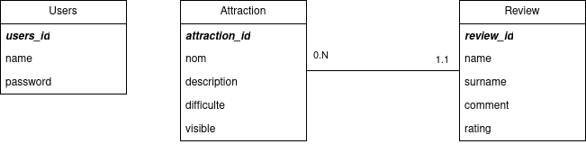

# Technical Documentation

## Architecture

The app is divided in two sections, the api which is contained in the `python` folder and the client which is available in the `parc` directory.

Docker is used throughout the project to manage these two apps, the containers hot reloads both part of the application meaning that every change made to the source will be reflected automaticaly on the served app.

## Database

### Schema

The database can be modeled through the following diagram


### Init database

Use the following command to shell into the api

```shell
docker compose exec api sh
```

Running the following command will recreate the datase tables contained inside the `init.sql` file and insert data contained in the `create.sql` file

```shell
python3 init.py
```

## Components

### Accueil

The `accueil` component corresponds to the home page of the website.

### Admin

The `admin` component corresponds to the admin page of the website where an authorized person can modify, add, or delete attrations.

### Attraction

The `attraction` component corresponds to the page on which users can see information and reviews about an attraction, the user can also add a review on this page.

### Login

The `login` component corresponds to the page that allows an admin to log in to their account.

## Translation

The translation is handled by `ngx-translate`, to modify the translation the `assets/locales/{locale}.json` has to be modified.

## Tests

To test the app use the following command in the `parc` folder

```bash
ng test
```
